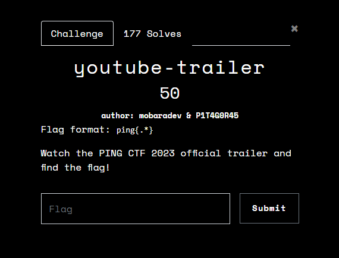
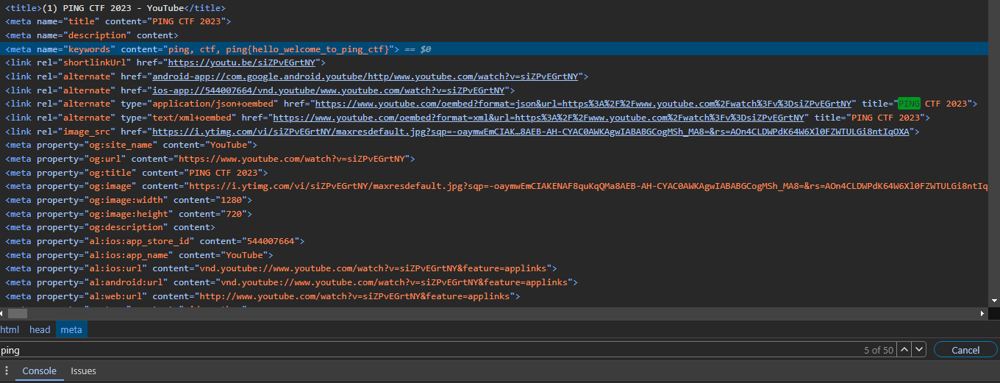

<h1>PingCTF 2023 Writeup</h1>

<h2>NAME:</h2> youtube-trailer
 
<h2>CATEGORY:</h2> Web Exploitation.
 
<h2>DESCRIPTION:</h2> Watch the PING CTF 2023 official trailer and find the flag!
 
<h2>FLAG FORMAT:</h2> ping{.*}
 
<h2>POINTS:</h2> 50
 
<h2>TOTAL SOLVES:</h2> 177
 
<h2>DIFFICULTY:</h2> Easy</h2>
 
<h2>HOW TO SOLVE: </h2>

Step 1: I went to the Youtube trailer video (which may have been given in the challenge tab as a link, but can still (potentially) be found via search engine) at: https://www.youtube.com/watch?v=siZPvEGrtNY.

Step 2: Since no information regarding the flag was found in the video, I decided to inspect the page element.

Step 3: Look around for any metadata.

Step 4: Since the page element was extremely cluttered (and it was 3am when I attempted this), I ended up using a quicker method.
Hit CTRL+F (or equivalent) and search for the flag format. In this case, we will be searching for 'ping'. It can be more efficient to search for 'ping{', but in <u><i>some</i></u> cases, it can return no results.

Step 5: I went through each instance of the searched flag format until the flag was found.
(which looked like this:)

Step 6: Extract the flag (which was found to be 'ping{hello_welcome_to_ping_ctf}') and input it into the 'Flag' box on the challenge tab (the first image).

Again, this challenge was right up my alley, but I hope this helped anybody who may be new to CTFs.
Also, just because this challenge was easy, this method can be used for numerous challenges. (See my other Writeup in /TheCyberCoopCTF/Lost-at-Sea which was in the forensics category).
