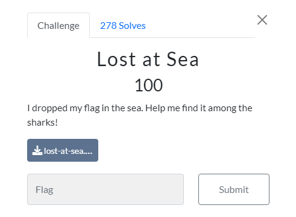
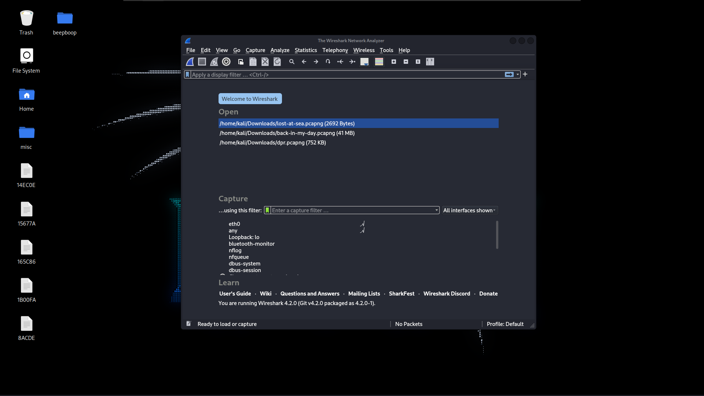
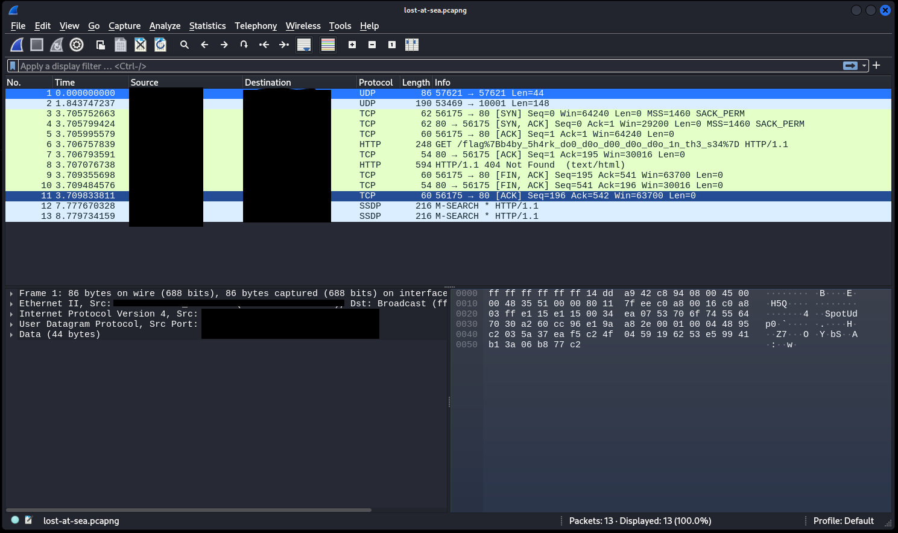
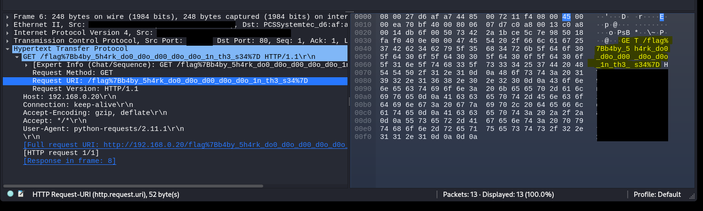

<h1>CTF Writeup</h1>

<h2>NAME:</h2> Lost at Sea
 
<h2>CATEGORY:</h2> Forensics
 
<h2>DESCRIPTION:</h2>I dropped my flag in the sea. Help me find it among the sharks!
 
<h2>FLAG FORMAT:</h2> flag{.*}
 
<h2>POINTS:</h2> 100
 
<h2>TOTAL SOLVES:</h2> 278
 
<h2>DIFFICULTY:</h2> Easy
 
<h2>OPERATING SYSTEM USED:</h2> Linux (VM) (anything with Wireshark (or equivalent tool) will work)
 
<h2>HOW TO SOLVE: </h2>
 
<strong>Step 1:</strong> Open Wireshark. Since I had only just learnt about wireshark prior to this challenge being released, when I saw the mention of 'sharks' in the challenge description, I immediately though to open Wireshark.
This and the fact that the file extension was .pcapng, which I had also previously learnt was openable in Wireshark.

<strong>Step 2:</strong> Sift through the packets (in the green -see image below). I just used my arrow keys to view each packet quickly, I came across the flag pretty quickly. 
While writing this Writeup, I have realised that the information column tells you the flag.

 
 

<strong>Step 3:</strong> Copy the flag (I couldn't directly copy it, so I resorted to hand-typing it) and input it into the 'Flag' box in the challenge tab.
Flag: flag{b4by_5h4rk_do0_d0o_d00_d0o_d0o_1n_th3_s34}

Likewise to the 2023 - PingCTF 'youtube-trailer' writeup, this challenge was relatively easy in terms of steps and solves. But, I hope this has helped anyone who may have needed it. 

Please leave any feedback below. I would like to improve my Writeups and general structure skills.
